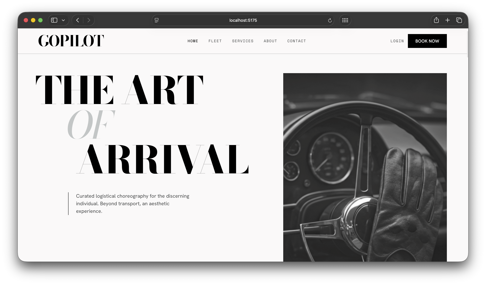

<div align="center">


# GoPilot

**Premium Chauffeur Booking Platform**

[](https://react.dev)
[](https://nodejs.org)
[](https://mongodb.com)
[](https://tailwindcss.com)
[](https://vitejs.dev)
[](https://docker.com)
[](LICENSE)

[Live Demo](https://your-frontend.vercel.app) &nbsp;·&nbsp; [Admin Panel](https://your-admin.vercel.app) &nbsp;·&nbsp; [API Docs](docs/API.md) &nbsp;·&nbsp; [Deploy Guide](docs/DEPLOYMENT.md)

</div>

---



---

## Overview

**GoPilot** connects discerning clients with elite professional chauffeurs. Built on the MERN stack, it delivers a modern editorial design, real-time availability, secure Razorpay payments, and a full-featured admin dashboard — deployed via Docker on Render (backend) and Vercel (frontend + admin).

---

## Features

<table>
<tr>
<td valign="top" width="33%">

**Client App**
- Browse & filter elite pilots
- Real-time availability search
- Booking with fare calculation
- Razorpay payment integration
- User dashboard & booking history
- Email verification & password reset

</td>
<td valign="top" width="33%">

**Admin Panel**
- Dashboard analytics & KPIs
- User & driver management
- Booking oversight & status control
- Bulk notifications via email
- Role-based access control
- Driver approval workflow

</td>
<td valign="top" width="33%">

**Backend API**
- RESTful API with JWT auth
- Refresh token rotation
- Rate limiting & brute-force protection
- ImageKit photo/document uploads
- Brevo transactional emails
- MongoDB geospatial queries

</td>
</tr>
</table>

---

## Tech Stack

| Layer | Technologies |
|-------|-------------|
| **Frontend** | React 18, Vite 6, React Router 7, Tailwind CSS 3, Framer Motion, Axios, Sonner |
| **Admin** | React 18, Vite 6, Tailwind CSS 3, Recharts, Lucide React |
| **Backend** | Node.js 20, Express 4, MongoDB 7, Mongoose, JWT, bcrypt, Helmet, Multer |
| **Infrastructure** | Docker (multi-stage), Render (backend), Vercel (frontend + admin) |
| **External Services** | Razorpay (payments), ImageKit (media), Brevo (email), MongoDB Atlas |

---

## Project Structure

```
gopilot/
├── frontend/               # Client React app (Vite + Tailwind)
│   ├── src/
│   │   ├── pages/          # Route-level pages (lazy loaded)
│   │   ├── components/     # Shared + layout components
│   │   ├── context/        # Auth context
│   │   ├── hooks/          # Custom hooks
│   │   └── services/       # API layer (Axios)
│   └── vercel.json         # SPA routing + security headers
│
├── admin/                  # Admin dashboard React app
│   ├── src/
│   └── vercel.json         # SPA routing + security headers
│
├── backend/                # Express REST API
│   ├── controllers/        # Route handlers
│   ├── models/             # Mongoose schemas
│   ├── routes/             # Express routers
│   ├── middleware/         # Auth, validation, rate limiting
│   ├── utils/              # Email, file upload, helpers
│   ├── Dockerfile          # Multi-stage production image
│   └── render.yaml         # Render deployment blueprint
│
├── docs/                   # Documentation
│   ├── API.md              # Full API endpoint reference
│   ├── DEPLOYMENT.md       # Render + Vercel deployment guide
│   ├── SETUP.md            # Local development setup
│   ├── CONTRIBUTING.md     # Contribution guidelines
│   └── .env.example        # Environment variables template
│
├── logo.png
├── Homepage.png
├── LICENSE
└── README.md
```

---

## Quick Start

**Prerequisites:** Node.js 20+, MongoDB (local or Atlas), npm

```bash
# 1. Clone
git clone https://github.com/Lagadnakul/gopilot.git
cd gopilot

# 2. Backend
cd backend
cp ../.env.example .env    # Fill in your values
npm install
npm run dev                # Runs on http://localhost:4000

# 3. Frontend (new terminal)
cd frontend
npm install
npm run dev                # Runs on http://localhost:5173

# 4. Admin (new terminal)
cd admin
npm install
npm run dev                # Runs on http://localhost:5174
```

---

## Environment Variables

Copy `docs/.env.example` to `backend/.env` and fill in your values:

```env
# Server
PORT=4000
NODE_ENV=development
MONGO_URI=mongodb+srv://...
JWT_SECRET=your-32-char-minimum-secret
JWT_REFRESH_SECRET=another-32-char-secret

# URLs (update for production)
FRONTEND_URL=http://localhost:5173
ADMIN_URL=http://localhost:5174

# External Services
RAZORPAY_KEY_ID=rzp_test_...
RAZORPAY_KEY_SECRET=...
BREVO_API_KEY=...
BREVO_FROM_EMAIL=noreply@yourdomain.com
IMAGEKIT_PUBLIC_KEY=...
IMAGEKIT_PRIVATE_KEY=...
IMAGEKIT_URL_ENDPOINT=https://ik.imagekit.io/your-id
```

```env
# Frontend & Admin (.env in each folder)
VITE_API_URL=http://localhost:4000/api
VITE_RAZORPAY_KEY_ID=rzp_test_...
```

> See [`docs/.env.example`](docs/.env.example) for the full list.

---

## Deployment

### Backend → Render

Render picks up `backend/render.yaml` automatically. Set secrets in the Render dashboard (any `sync: false` env var).

```bash
# Or deploy manually via Docker
docker build -t gopilot-api ./backend
docker run -p 4000:4000 --env-file backend/.env gopilot-api
```

### Frontend & Admin → Vercel

Each app has its own `vercel.json` pre-configured with SPA rewrites and security headers. Import each as a separate Vercel project and set `VITE_API_URL` to your Render backend URL.

> Full guide: [docs/DEPLOYMENT.md](docs/DEPLOYMENT.md)

---

## API Documentation

Full endpoint reference with request/response examples in [docs/API.md](docs/API.md).

Key endpoint groups:

| Group | Base Path |
|-------|-----------|
| Auth | `/api/auth` |
| Users | `/api/users` |
| Drivers | `/api/drivers` |
| Bookings | `/api/bookings` |
| Payments | `/api/payments` |
| Admin | `/api/admin` |

---

## Contributing

Contributions are welcome. See [docs/CONTRIBUTING.md](docs/CONTRIBUTING.md) for guidelines.

```bash
# Standard workflow
git checkout -b feature/your-feature
# make changes
git commit -m "feat: add your feature"
git push origin feature/your-feature
# open a Pull Request
```

---

## License

Licensed under the [MIT License](LICENSE).

---

<div align="center">
  <sub>Built by <a href="https://github.com/Lagadnakul">Lagadnakul</a> · Designed with precision, deployed with confidence.</sub>
</div>
